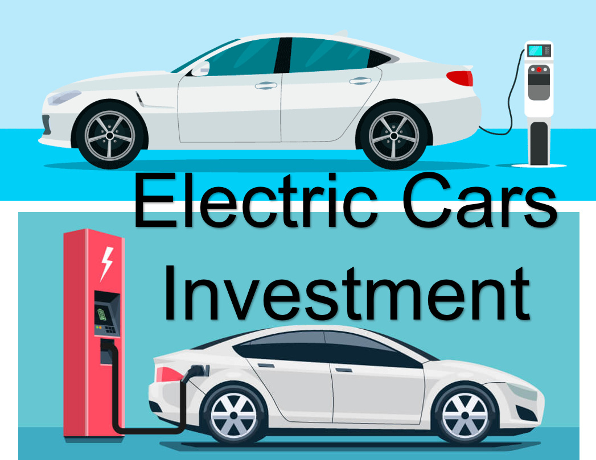

  
<h1 align="center">Electric Cars Long Term Investment</h1>

### Description:
#### This a project of long term investment and see which electric cars is a good long term investment. Analyzing technical and fundamental. Analyzing historical data (2 years) and calculate performance measurements, back-testing, forecasting, and using Capital Asset Pricing Model. Testing different trading strategies. Finding stock with lowest risks with highest returns. 

### Prerequistes
#### Microsoft Azure Machine Learning Studio  
#### Python 3.5+
#### Jupyter Notebook Python 3.5  
#### Excel 2016
#### Power BI  
#### Tableau

### Stock Tickers:
#### RIVN - Rivian Automotive, Inc.  
#### LCID - Lucid Group, Inc.    
#### GM - General Motors Company  
#### F - Ford Motor Company  
#### HMC - Honda Motor Co., Ltd.  
#### TSLA - Tesla, Inc.  
#### Use accountant statements and historical price in Excel, python, Power BI, and Tableau for Stocks Analysis

### Financial Ratio or Accounting Ratio:  

Profitability Ratio - financial metrics to evaluate the ability of a company to generate income (profit) relative to revenue, balance sheet assets, operating costs, and shareholders’ equity during a specific period of time. It shows how well a company utilizes its assets to produce profit and value to shareholders.  

Operating Ratio – financial metrics to evaluate how well a company is using their assets.  

Leverage Ratios – financial metrics to evaluate how much of an organization's capital comes from debt and it shows a solid indication of whether a business can make good on its financial obligations.  

Valuation Ratios – financial metrics to evaluate how the relationship between the market value of a company or its equity and some fundamental financial metric (e.g., earnings).  

Liquidity Ratios – financial metrics to evaluate how the company's ability to pay debt obligations and its margin of safety through the calculation of metrics including the current ratio, quick ratio, and operating cash flow ratio.   

### Data
https://finance.yahoo.com/  

## Author:  
### Tin Hang  

## Disclaimer
### 🔴 This is not financial advice. Please conduct your own research and refrain from using this code for investing or trading in stocks. If you are interested in the stock market, consider reading books on investment, trading, and finance. It is advisable to consult with a professional investment advisor before making any investment decisions. Remember, this information is for educational purposes only.  
